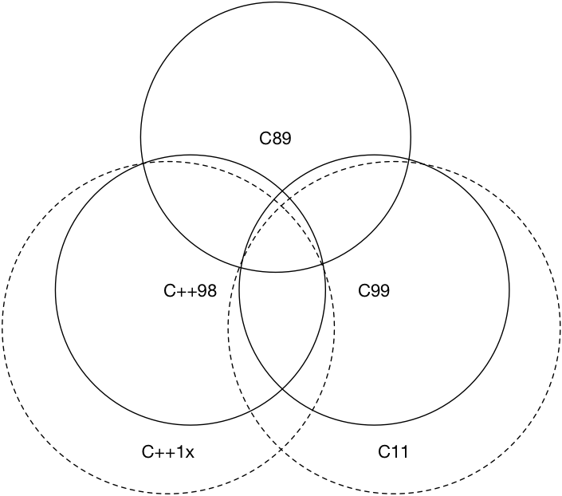

# 第 1 章 迈向现代 C++

[TOC]

**编译环境**：本书将使用 `clang++` 作为唯一使用的编译器，同时总是在代码中使用 `-std=c++2a` 编译标志。

```bash
> clang++ -v
Apple LLVM version 10.0.1 (clang-1001.0.46.4)
Target: x86_64-apple-darwin18.6.0
Thread model: posix
InstalledDir: /Library/Developer/CommandLineTools/usr/bin
```

## 1.1 被弃用的特性

在学习现代 C++ 之前，我们先了解一下从 C++11 开始，被弃用的主要特性：

> **注意**：弃用并非彻底不能用，只是用于暗示程序员这些特性将从未来的标准中消失，应该尽量避免使用。但是，已弃用的特性依然是标准库的一部分，并且出于兼容性的考虑，大部分特性其实会『永久』保留。

- **不再允许字符串字面值常量赋值给一个 `char *`。如果需要用字符串字面值常量赋值和初始化一个 `char *`，应该使用 `const char *` 或者 `auto`。**
    ```cpp
    char *str = "hello world!"; // 将出现弃用警告
    ```

- **C++98 异常说明、 `unexpected_handler`、`set_unexpected()` 等相关特性被弃用，应该使用 `noexcept`。**

- **`auto_ptr` 被弃用，应使用 `unique_ptr`。**

- **`register` 关键字被弃用，可以使用但不再具备任何实际含义。**

- **`bool` 类型的 `++` 操作被弃用。**

- **如果一个类有析构函数，为其生成拷贝构造函数和拷贝赋值运算符的特性被弃用了。**

- **C 语言风格的类型转换被弃用（即在变量前使用 `(convert_type)`），应该使用 `static_cast`、`reinterpret_cast`、`const_cast` 来进行类型转换。**

- **特别地，在最新的 C++17 标准中弃用了一些可以使用的 C 标准库，例如 `<ccomplex>`、`<cstdalign>`、`<cstdbool>` 与 `<ctgmath>` 等**

- ……等等

还有一些其他诸如参数绑定（C++11 提供了 `std::bind` 和 `std::function`）、`export` 等特性也均被弃用。前面提到的这些特性**如果你从未使用或者听说过，也请不要尝试去了解他们，应该向新标准靠拢**，直接学习新特性。毕竟，技术是向前发展的。

## 1.2 与 C 的兼容性

出于一些不可抗力、历史原因，我们不得不在 C++ 中使用一些 C 语言代码（甚至古老的 C 语言代码），例如 Linux 系统调用。在现代 C++ 出现之前，大部分人当谈及『C 与 C++ 的区别是什么』时，普遍除了回答面向对象的类特性、泛型编程的模板特性外，就没有其他的看法了，甚至直接回答『差不多』，也是大有人在。图 1.2 中的韦恩图大致上回答了 C 和 C++ 相关的兼容情况。



从现在开始，你的脑子里应该树立『**C++ 不是 C 的一个超集**』这个观念（而且从一开始就不是，后面的[进一步阅读的参考文献](#进一步阅读的参考文献)中给出了 C++98 和 C99 之间的区别）。在编写 C++ 时，也应该尽可能的避免使用诸如 `void*` 之类的程序风格。而在不得不使用 C 时，应该注意使用 `extern "C"` 这种特性，将 C 语言的代码与 C++代码进行分离编译，再统一链接这种做法，例如：

```cpp
// foo.h
#ifdef __cplusplus
extern "C" {
#endif

int add(int x, int y);

#ifdef __cplusplus
}
#endif

// foo.c
int add(int x, int y) {
    return x+y;
}

// 1.1.cpp
#include "foo.h"
#include <iostream>
#include <functional>

int main() {
    [out = std::ref(std::cout << "Result from C code: " << add(1, 2))](){
        out.get() << ".\n";
    }();
    return 0;
}
```

应先使用 `gcc` 编译 C 语言的代码：

```bash
gcc -c foo.c
```

编译出 `foo.o` 文件，再使用 `clang++` 将 C++代码和 `.o` 文件链接起来（或者都编译为 `.o` 再统一链接）：

```bash
clang++ 1.1.cpp foo.o -std=c++2a -o 1.1
```

当然，你可以使用 `Makefile` 来编译上面的代码：

```makefile
C = gcc
CXX = clang++

SOURCE_C = foo.c
OBJECTS_C = foo.o

SOURCE_CXX = 1.1.cpp

TARGET = 1.1
LDFLAGS_COMMON = -std=c++2a

all:
	$(C) -c $(SOURCE_C)
	$(CXX) $(SOURCE_CXX) $(OBJECTS_C) $(LDFLAGS_COMMON) -o $(TARGET)
clean:
	rm -rf *.o $(TARGET)
```

> 注意：`Makefile` 中的缩进是制表符而不是空格符，如果你直接复制这段代码到你的编辑器中，制表符可能会被自动替换掉，请自行确保在 `Makefile` 中的缩进是由制表符完成的。
>
> 如果你还不知道 Makefile 的使用也没有关系，本教程中不会构建过于复杂的代码，简单的在命令行中使用 `clang++ -std=c++2a` 也可以阅读本书。

如果你是首次接触现代 C++，那么你很可能还看不懂上面的那一小段代码，即：

```cpp
[out = std::ref(std::cout << "Result from C code: " << add(1, 2))](){
    out.get() << ".\n";
}();
```

不必担心，本书的后续章节将为你介绍这一切。

[返回目录](./toc.md) | [上一章](./00-preface.md) | [下一章 语言可用性强化](./02-usability.md)

## 进一步阅读的参考文献

- [C++ 语言导学. Bjarne Stroustrup](https://www.amazon.cn/dp/B00WUBYBYS/ref=sr_1_1?ie=UTF8&qid=1522400738&sr=8-1&keywords=C%2B%2B+%E8%AF%AD%E8%A8%80%E5%AF%BC%E5%AD%A6)
- [C++ 历史](http://en.cppreference.com/w/cpp/language/history)
- [C++ 特性在 GCC/Clang 等编译器中的支持情况](http://en.cppreference.com/w/cpp/compiler_support)
- [C++98 与 C99 之间的区别](http://david.tribble.com/text/cdiffs.htm#C99-vs-CPP98)

## 许可

<a rel="license" href="http://creativecommons.org/licenses/by-nc-nd/4.0/"></a>

本书系[欧长坤](https://github.com/changkun)著，采用[知识共享署名-非商业性使用-禁止演绎 4.0 国际许可协议](http://creativecommons.org/licenses/by-nc-nd/4.0/)许可。项目中代码使用 MIT 协议开源，参见[许可](../../LICENSE)。
